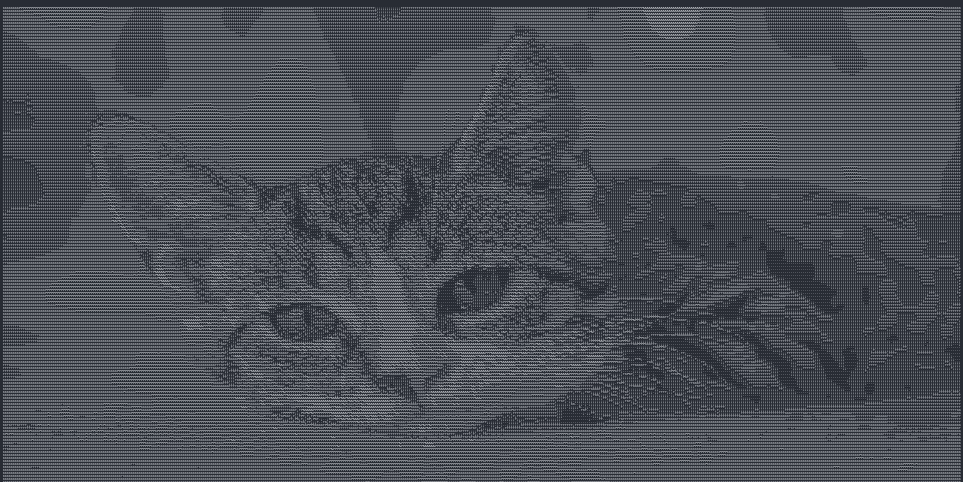

# go-image-to-ascii

## Overview
This tool is used to output an ASCII art of an input image. Give it the path to your image, or paste in
a network image URL, and it will print the ASCII art of the image. An example of input/output is shown below.

## Key Features
* Resize an image using a percentage scale
* Choose a mode to fit your terminal theme

Input:


Output:





## Get Started
Start by cloning the repository in your local environment
```
git clone https://github.com/haidar1337/go-image-to-ascii/
```
Go's toolchain is required to run the program.
Run the following command from the root of the project.
```
go run .
```

The CLI starts and asks you for input, provide the path to an image in your local machine
or paste in the URL of a network image to print out the ASCII art
